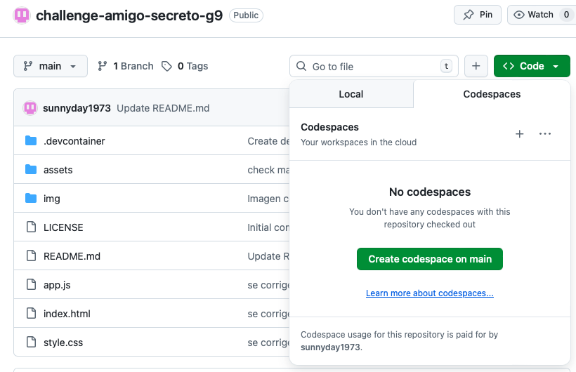

# Challenge Amigo secreto Alura Latam y ONE (Oracle Next Education) - G9

Proposito
---
Una aplicación que permita a los usuarios ingresar nombres de amigos en una lista para luego realizar un sorteo aleatorio y determinar quién es el "amigo secreto".
El usuario deberá agregar nombres mediante un campo de texto y un botón "Adicionar". Los nombres ingresados se mostrarán en una lista visible en la página, y al finalizar, un botón "Sortear Amigo" seleccionará uno de los nombres de forma aleatoria, mostrando el resultado en pantalla.

Fucionalidades
---
- **Agrega nombres**: Los usuarios escribirán el nombre de un amigo en un campo de texto y lo agregarán a una lista visible al hacer clic en "Adicionar".
- **Valida entrada**: Si el campo de texto está vacío, el programa mostrará una alerta pidiendo un nombre válido.
- **Visualiza la lista**: Los nombres ingresados aparecerán en una lista debajo del campo de entrada.
- **Sorteo aleatorio**: Al hacer clic en el botón "Sortear Amigo", se seleccionará aleatoriamente un nombre de la lista y se mostrará en la página.

Base
---
Repositório base proporcionado para el proyecto, con el código HTML y CSS se puede ser descargado desde [aquí](https://github.com/Oracle-Next-Education/challenge-amigo-secreto_esp).

## ¿Como puedes ejecutar un sorteo?
- Ejecútalo localmente en Visual Studio Code instalando la extensión **"Live Server"**
- Ejecútalo en el entorno virtual de GitHub. En el repositorio, haz clic en el botón verde Code → pestaña Codespaces → selecciona Create codespace on main (o la rama que quieras). 

